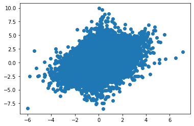

Dimensionality Reduction via PCA with Missing Data
##################################################
.. code:: ipython3

    import numpy as np
    from spalor.datasets import load_STT
    from scipy import sparse
    
    STTm=load_STT()
    data_matrix=STTm.T.to_numpy()

.. parsed-literal::

    /home/april/Code/spalor/spalor/datasets/STTm.pkl

.. code:: ipython3

    sA = sparse.coo_matrix(data_matrix)
    X=np.array([sA.row,sA.col])
    y=np.array(sA.data)
    
    print(X)

.. parsed-literal::

    [[   0    0    0 ...   30   30   30]
     [   0    1    2 ... 5517 5518 5519]]

.. code:: ipython3

    (num_samples,num_genes)=data_matrix.shape
    print("Number of samples: ", num_samples)
    print("Number of genes: ", num_genes)

.. parsed-literal::

    Number of samples:  31
    Number of genes:  5520

.. code:: ipython3

    from sklearn.model_selection import train_test_split
    X_train, X_test, y_train, y_test = train_test_split(X.transpose(), y, test_size=0.6, random_state=42)
    print("Proportion of measurements available: ",len(y_train)/len(y))

.. parsed-literal::

    Proportion of measurements available:  0.39999532456299275

.. code:: ipython3

    from spalor.models import MC
    mc=MC(num_samples, num_genes,2)
    mc.fit(X_train.transpose(), y_train)
    
    y_predict=mc.predict(X_test.transpose())

.. code:: ipython3

    import matplotlib.pyplot as plt
    
    plt.scatter(y_predict, y_test)
    plt.show()
    
    slope, intercept, r_value, p_value, std_err = scipy.stats.linregress(y_predict,y_test)
    
    print("r squared value: ",r_value)

.. parsed-literal::

    r squared value:  0.41641933456374736

.. code:: ipython3

    pc1=mc.U[:,0]
    pc2=mc.U[:,1]
    
    plt.scatter(pc1[0:10],pc2[0:10])
    plt.scatter(pc1[10:22],pc2[10:22])
    plt.scatter(pc1[22:31],pc2[22:31])
    
    plt.show()

.. image:: output_6_0.png

