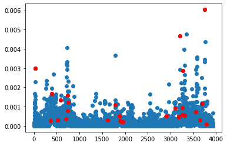
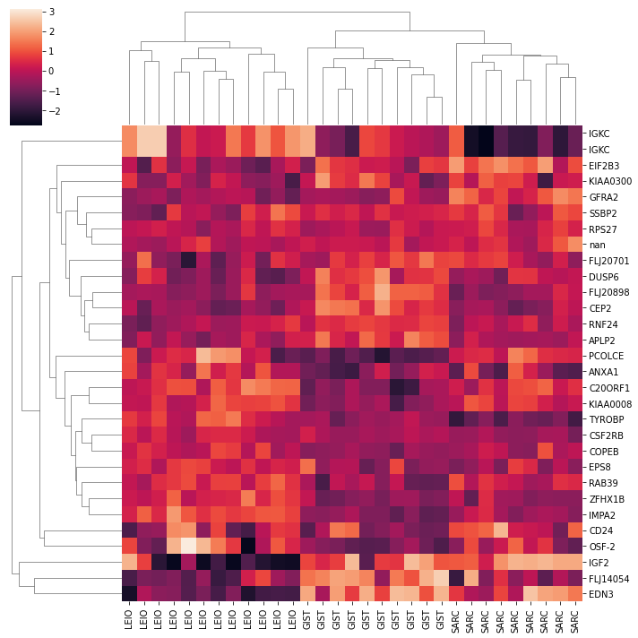

CX Matrix Decompositions for Tumour Classifications
===================================================

In this example, we are going to replicate one of the experiements from
the paper `CUR matrix decompositions for improved data
analysis <https://www.pnas.org/doi/10.1073/pnas.0803205106>`__, which
uses data from `Nielson et.
al. (2002) <https://doi.org/10.1016/S0140-6736(02)08270-3>`__. We have a
dataset of gene expressions for 3,935 genes from 31 different tumours,
with three different cancer subtypes represented in the dataset, and the
question we want to answer is: can we determine the type of tumour from
just a handful of the 4,000 different genes?

We are going to do this by picking genes that have high *leverage
scores*.

First step is to import the data:

.. code:: ipython3

    import pandas
    from spalor.models import CUR
    from spalor.datasets import Nielsen2002
    gex=Nielsen2002()
    gex.head()

.. raw:: html

    

    
    <table border="1" class="dataframe">
      <thead>
        <tr style="text-align: right;">
          <th></th>
          <th>GIST</th>
          <th>GIST</th>
          <th>GIST</th>
          <th>GIST</th>
          <th>GIST</th>
          <th>GIST</th>
          <th>GIST</th>
          <th>GIST</th>
          <th>GIST</th>
          <th>GIST</th>
          <th>...</th>
          <th>LEIO</th>
          <th>SARC</th>
          <th>SARC</th>
          <th>SARC</th>
          <th>SARC</th>
          <th>SARC</th>
          <th>SARC</th>
          <th>SARC</th>
          <th>SARC</th>
          <th>SARC</th>
        </tr>
        <tr>
          <th>Gene</th>
          <th></th>
          <th></th>
          <th></th>
          <th></th>
          <th></th>
          <th></th>
          <th></th>
          <th></th>
          <th></th>
          <th></th>
          <th></th>
          <th></th>
          <th></th>
          <th></th>
          <th></th>
          <th></th>
          <th></th>
          <th></th>
          <th></th>
          <th></th>
          <th></th>
        </tr>
      </thead>
      <tbody>
        <tr>
          <th>TACSTD2</th>
          <td>-1.3650</td>
          <td>-0.7588</td>
          <td>0.33435</td>
          <td>1.7160</td>
          <td>0.18766</td>
          <td>0.1467</td>
          <td>0.3831</td>
          <td>0.8449</td>
          <td>-0.7469</td>
          <td>0.9075</td>
          <td>...</td>
          <td>-0.2423</td>
          <td>-1.9880</td>
          <td>1.6110</td>
          <td>-0.9822</td>
          <td>-2.3360</td>
          <td>-0.7156</td>
          <td>-0.6364</td>
          <td>1.8910</td>
          <td>-0.4032</td>
          <td>-0.3697</td>
        </tr>
        <tr>
          <th>GJB2</th>
          <td>-0.0950</td>
          <td>0.3063</td>
          <td>0.63040</td>
          <td>0.7806</td>
          <td>0.81530</td>
          <td>-0.9518</td>
          <td>-0.7240</td>
          <td>-1.0940</td>
          <td>-0.4872</td>
          <td>-0.6808</td>
          <td>...</td>
          <td>-1.5760</td>
          <td>0.0433</td>
          <td>0.4723</td>
          <td>-1.2890</td>
          <td>-1.7290</td>
          <td>-0.9109</td>
          <td>-0.6991</td>
          <td>-0.5254</td>
          <td>-0.1763</td>
          <td>-0.1103</td>
        </tr>
        <tr>
          <th>CUGBP2</th>
          <td>-0.6385</td>
          <td>-0.2870</td>
          <td>-0.17250</td>
          <td>-0.5951</td>
          <td>0.17030</td>
          <td>0.6095</td>
          <td>-0.1460</td>
          <td>0.4343</td>
          <td>-0.8280</td>
          <td>-0.3281</td>
          <td>...</td>
          <td>0.1620</td>
          <td>-0.0807</td>
          <td>0.2439</td>
          <td>-3.5830</td>
          <td>-0.0795</td>
          <td>0.8805</td>
          <td>1.6600</td>
          <td>2.0190</td>
          <td>-0.2785</td>
          <td>-0.2276</td>
        </tr>
        <tr>
          <th>KIAA0080</th>
          <td>-0.5501</td>
          <td>1.0980</td>
          <td>1.11400</td>
          <td>1.0330</td>
          <td>-0.34850</td>
          <td>0.0632</td>
          <td>-0.7378</td>
          <td>0.0826</td>
          <td>0.6216</td>
          <td>-1.3870</td>
          <td>...</td>
          <td>0.9759</td>
          <td>1.2240</td>
          <td>-0.6170</td>
          <td>-3.1070</td>
          <td>0.6073</td>
          <td>0.7063</td>
          <td>-1.1070</td>
          <td>0.5016</td>
          <td>-0.0544</td>
          <td>-0.7320</td>
        </tr>
        <tr>
          <th>CED-6</th>
          <td>-0.4295</td>
          <td>-3.2950</td>
          <td>-2.00600</td>
          <td>0.5949</td>
          <td>0.48850</td>
          <td>-1.3600</td>
          <td>-0.5136</td>
          <td>-1.5670</td>
          <td>1.5310</td>
          <td>0.1229</td>
          <td>...</td>
          <td>-0.8084</td>
          <td>0.2960</td>
          <td>-0.8529</td>
          <td>-1.9260</td>
          <td>-0.5620</td>
          <td>0.6970</td>
          <td>0.8229</td>
          <td>2.1340</td>
          <td>2.0010</td>
          <td>1.5360</td>
        </tr>
      </tbody>
    </table>
    
5 rows × 31 columns

    

.. code:: ipython3

    genes=gex.index.to_numpy();
    cancer_type=gex.columns
    data=gex.to_numpy().T

Theres a function in SpaLor for calculating the leverage scores. It
requires a rank, but this is not the same as the number of columns we
hope to sample. The leverage scores are how important a given column is
when we are constructing a rank *r* approximation of the matrix. We are
going to calculate and plot them here:

.. code:: ipython3

    from spalor.matrix_tools import leverage_score
    from matplotlib import pyplot as plt
    
    ls=leverage_score(data,k=3, axis=1)
    plt.plot(ls,'o')
    plt.show()

.. image:: interpretable_low_rank_models_for_tumour_classification_files/interpretable_low_rank_models_for_tumour_classification_4_0.png

A good way to think about this plot is that the genes in this plot that
have a much larger leverage score than average are the ones that contain
the most information. When we fit our data to a CX model from SpaLoR,
its going to randomly sample genes with a probability proportional to
the leverage score squared.

.. code:: ipython3

    # from spalor.models.cx import CX
    import numpy as np
    import pandas as pd
    cx=CX(n_components=30, method="exact")
    C=cx.fit_transform(data)
    C=pd.DataFrame(C, columns=genes[cx.cols], index=cancer_type)
    print("genes selected: ",genes[cx.cols])

.. parsed-literal::

    genes selected:  ['ANXA1' 'IGKC' 'FLJ20898' 'CSF2RB' 'RNF24' 'IGKC' 'C20ORF1' 'ZFHX1B'
     'RPS27' 'CD24' 'PCOLCE' 'DUSP6' 'EPS8' 'SSBP2' 'CEP2' 'GFRA2' 'FLJ20701'
     'KIAA0008' 'KIAA0300' 'FLJ14054' 'COPEB' 'IGF2' 'TYROBP' 'IMPA2' 'RAB39'
     'OSF-2' 'APLP2' nan 'EIF2B3' 'EDN3']

Here is the same plot as before with the selected genes highlighted red.
Most of them have a high leverage score, but some do not.

.. code:: ipython3

    plt.plot(ls,'o')
    ls=leverage_score(data,k=1, axis=1)
    
    #cols=np.where(20* ls > np.random.rand(*ls.shape))[0]
    plt.plot(cx.cols, ls[cx.cols],'or')
    plt.show()

A clustermap of the genes shows the limited gene set can seperate the
three different types of cancer.

.. code:: ipython3

    import seaborn as sns
    sns.clustermap(C.T, col_cluster=1, z_score=1)

.. parsed-literal::

    <seaborn.matrix.ClusterGrid at 0x7f851d9ea370>

