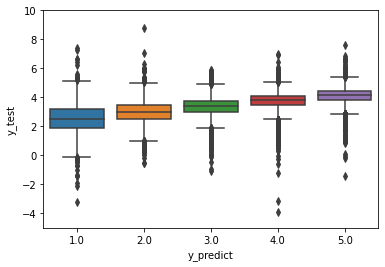

Movie Recomendations with Matrix Completion
===========================================

Consider a matrix where the rows are Netflix users, the columns are
movies, and the entries are the ratings each user gives each movie. This
matrix is going to be very sparesly filled in, because most people are
going to watch just a small fraction of the movies on netflix, but if we
can predict entries of the matrix, then we could recomend movies someone
hasn’t seen yet.

We’re going to assume that the data is approximately *low-rank*, which
means that each column can be approximated with a linear combination of
just a handful of other columns. Let’s take the movies Breakfast Club
and Pretty in Pink as an example. I would bet that the way individuals
rate these two movies is highly correlated, and the columns associated
with each movie should be very similiar. Now lets throw Titanic into the
mix. While I wouldn’t expect it to be the same, it might be similiar. It
might also be similiar to other period pieces featuring forbidden love,
like Pride and Prejudice, or movies with Leonardo DeCaprio, like Wolf of
Wallstreet. So, I would expect that the ratings for Titanic might look
like an average of the ratings for all of these movies. The point is
that the ratings for a specific movie should be pretty close to a linear
combination of ratings of just a few other similiar movies.

A common dataset for movie recommendations comes from MovieLens, and
though they have datasets with 25 million ratings, we’re going to stick
with 1 million for simplicity. The data can be downloaded from
grouplens.org, or with the following bash commands:

.. code:: ipython3

    !curl https://files.grouplens.org/datasets/movielens/ml-1m.zip -O
    !unzip ml-1m.zip

.. parsed-literal::

      % Total    % Received % Xferd  Average Speed   Time    Time     Time  Current
                                     Dload  Upload   Total   Spent    Left  Speed
    100 5778k  100 5778k    0     0  3979k      0  0:00:01  0:00:01 --:--:-- 3977k
    Archive:  ml-1m.zip
       creating: ml-1m/
      inflating: ml-1m/movies.dat        
      inflating: ml-1m/ratings.dat       
      inflating: ml-1m/README            
      inflating: ml-1m/users.dat         

Read the data in with Numpy:

.. code:: ipython3

    import numpy as np
    data = np.loadtxt('ml-1m/ratings.dat',delimiter='::' )
    print(data[:][0:3])

.. parsed-literal::

    [[1.00000000e+00 1.19300000e+03 5.00000000e+00 9.78300760e+08]
     [1.00000000e+00 6.61000000e+02 3.00000000e+00 9.78302109e+08]
     [1.00000000e+00 9.14000000e+02 3.00000000e+00 9.78301968e+08]]

The first column is the user ID, the second is the movie ID, the third
is the rating (1,2,3,4, or 5), and the last is a time stamp (which we
don’t need to worry about). We want the rows of the matrix to be users,
and the columns should be movies.

Next we divide the data into training and testing sets. Note that we’re
also going to subtract 3 from each of the ratings that way the middle
value is 0.

.. code:: ipython3

    X=data[:, [0,1]].astype(int)-1
    y=data[:,2] - 3
    
    from sklearn.model_selection import train_test_split
    X_train, X_test, y_train, y_test = train_test_split(X, y, test_size=0.1, random_state=42)

.. code:: ipython3

    from spalor.models import MC
    from statistics import mean
    
    mc_model=MC(n_components=5)
    mc_model.fit(X_train, y_train)
    y_predict=mc_model.predict(X_test.T)
    
    print("MAE:",mean(abs(y_test-y_predict)))
    print("Percent of predictions off my less than 1: ",np.sum(abs(y_test-y_predict)<1)/len(y_test))

.. parsed-literal::

    MAE: 0.7066785169566365
    Percent of predictions off my less than 1:  0.7507023525059737

The values of ``y_test`` are integers, so for each of the 5 ratings,
we’ll make a box plot of corresponding values of\ ``y_predict``.

.. code:: ipython3

    import seaborn as sns
    ax=sns.boxplot(x=y_test+3, y=y_predict+3)
    ax.set_ylim(-5, 10)
    ax.set_ylabel("y_test")
    ax.set_xlabel("y_predict")

.. parsed-literal::

    Text(0.5, 0, 'y_predict')

