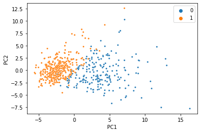

PCA with Missing Data
=====================

In this example, we’re going to use the Wisconsin breast cancer
diagnostics dataset, which is included as an example dataset in sci-kit
learn. It consists of 30 morphological features from 569 breast tumour
biopsies, along with a label of “malignant” or “benign”.

We start by loading in the data and necessary packages.

.. code:: ipython3

    import numpy as np
    import seaborn as sns
    
    from sklearn.preprocessing import StandardScaler
    from sklearn.decomposition import PCA
    from sklearn.datasets import load_breast_cancer
    
    breast_cancer = load_breast_cancer()
    normalized_data = StandardScaler().fit_transform(breast_cancer.data)

There’s a reason this is a classic ML demonstration dataset: The
features can predict the target using a linear model with near perfect
accuracy. When we do PCA and color the samples by diagnosis, we see an
almost perfect seperation with just two principal components.

.. code:: ipython3

    pca = PCA(n_components=2)
    pca_data = pca.fit_transform(normalized_data)
    ax=sns.scatterplot(x=pca_data[:,0], y=pca_data[:,1], hue=breast_cancer.target,s=10)
    ax.set_xlabel("PC1")
    ax.set_ylabel("PC2")

.. parsed-literal::

    Text(0, 0.5, 'PC2')

We were able to condense all 30 features into just two PCs, and the
information we care about is still there. That’s less than 7% of the
size of the original data, so it’s not too hard to believe we don’t need
100% of the data to get a meaningful low-dimensional representation.
Let’s simulate what would happen if 20% of the data was missing, and
replaced with NaN.

.. code:: ipython3

    missing_mask=np.random.rand(*normalized_data.shape)<0.2
    missing_data=normalized_data.copy()
    missing_data[missing_mask]=np.nan
    missing_data[0:5, 0:5]

.. parsed-literal::

    array([[        nan, -2.07333501,  1.26993369,  0.9843749 ,  1.56846633],
           [        nan, -0.35363241,         nan,  1.90870825, -0.82696245],
           [        nan,         nan,         nan,  1.55888363,  0.94221044],
           [-0.76890929,  0.25373211,         nan,         nan,  3.28355348],
           [ 1.75029663, -1.15181643,  1.77657315,  1.82622928,  0.28037183]])

If you tried giving sklearn’s PCA function this new matrix, you’d
definitely get an error, so we’ll use the MC class in SpaLoR. We can use
it the same way we used PCA:

.. code:: ipython3

    from spalor.models import MC
    mc = MC(n_components=2)
    pca_missing_data=mc.fit_transform(missing_data)
    ax=sns.scatterplot(x=pca_missing_data[:,0], y=pca_missing_data[:,1], hue=breast_cancer.target,s=10)
    ax.set_xlabel("PC1")
    ax.set_ylabel("PC2")

.. parsed-literal::

    Text(0, 0.5, 'PC2')

And voilà, we just did PCA with missing data and got almost the same
thing! This dataset is so clean, we can actually do it with much less
data too. Here’s the same thing with 80% of the data missing:

.. code:: ipython3

    missing_mask = np.random.rand(*normalized_data.shape) <0.8
    missing_data = normalized_data.copy()
    missing_data[missing_mask] = np.nan
    mc = MC(n_components=2)
    pca_missing_data=mc.fit_transform(missing_data)
    ax=sns.scatterplot(x=pca_missing_data[:,0], y=pca_missing_data[:,1], hue=breast_cancer.target,s=10)
    ax.set_xlabel("PC1")
    ax.set_ylabel("PC2")

.. parsed-literal::

    Text(0, 0.5, 'PC2')

At this point, the seperation gets a little messier, but for just 20% of
the data it’s not bad at all!
