```python
from sklearn.datasets import load_digits
digits = load_digits()
print(digits.data.shape)

import matplotlib.pyplot as plt 
plt.matshow(digits.images[0]) 
plt.show() 

```

    (1797, 64)


    
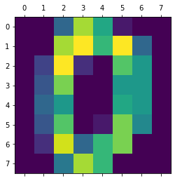
    


```python
import numpy as np
from sklearn.datasets import make_friedman1
from sklearn.decomposition import MiniBatchSparsePCA

transformer = MiniBatchSparsePCA(n_components=30, alpha=20, random_state=0)
transformer.fit(digits.data)

X_transformed = transformer.transform(digits.data)
X_transformed.shape

# most values in the components_ are zero (sparsity)
print(transformer.components_.shape)

```

    (30, 64)


```python
for i in range(0,30):
    plt.matshow(np.reshape(transformer.components_[i,:], (8,8))) 
    plt.show()

```


    
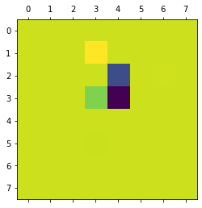
    


    
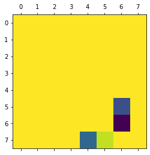
    


    
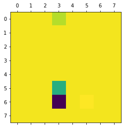
    


    
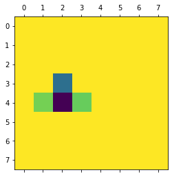
    


    
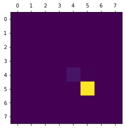
    


    
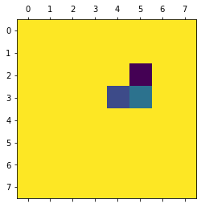
    


    
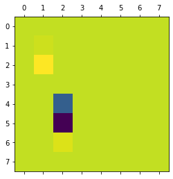
    


    
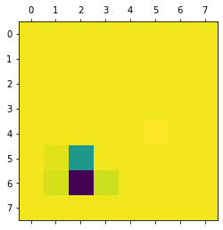
    


    
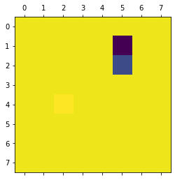
    


    
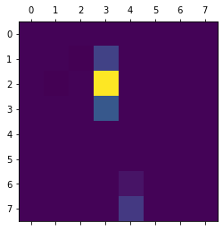
    


    
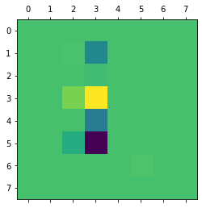
    


    
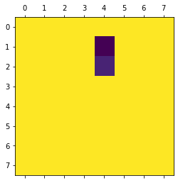
    


    
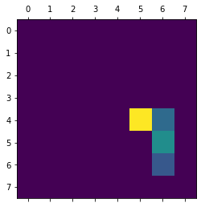
    


    
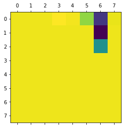
    


    

    


    
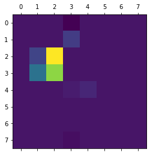
    


    
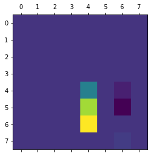
    


    

    


    
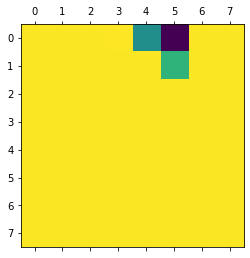
    


    
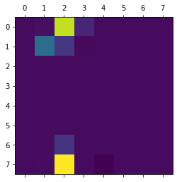
    


    
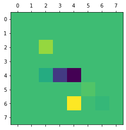
    


    
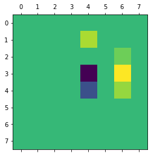
    


    
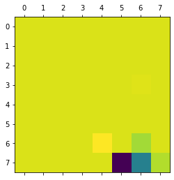
    


    
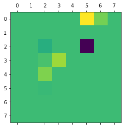
    


    

    


    
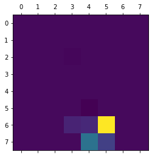
    


    
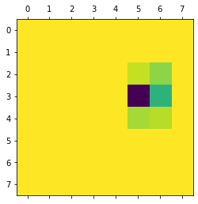
    


    
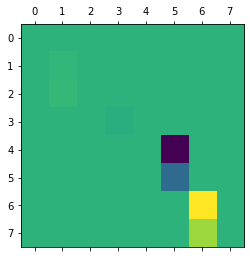
    


    
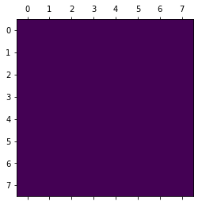
    


    
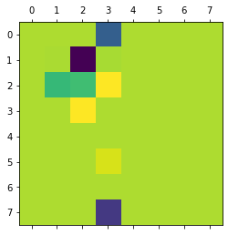
    


```python
y=digits.target

from sklearn.model_selection import train_test_split
X_train, X_test, y_train, y_test = train_test_split(X_transformed, y, test_size=0.33, random_state=42)

```


```python
from sklearn.neural_network import MLPClassifier

mlp = MLPClassifier()
mlp.fit(X_train,y_train)
y_pred = mlp.predict(X_test)

print(classification_report(y_test,y_pred))


```

                  precision    recall  f1-score   support
    
               0       0.98      1.00      0.99        55
               1       0.98      1.00      0.99        55
               2       1.00      0.98      0.99        52
               3       0.93      0.96      0.95        56
               4       0.98      1.00      0.99        64
               5       0.99      0.99      0.99        73
               6       1.00      0.98      0.99        57
               7       1.00      0.97      0.98        62
               8       0.94      0.90      0.92        52
               9       0.97      0.99      0.98        68
    
        accuracy                           0.98       594
       macro avg       0.98      0.98      0.98       594
    weighted avg       0.98      0.98      0.98       594
    


```python
data_path = "mnist/"
train_data = np.loadtxt(data_path + "mnist_train.csv", 
                        delimiter=",")
test_data = np.loadtxt(data_path + "mnist_test.csv", 
                       delimiter=",") 

```


```python

train_imgs = np.asfarray(train_data[:, 1:]) 
test_imgs = np.asfarray(test_data[:, 1:]) 

y_train = np.asfarray(train_data[:, :1])
y_test = np.asfarray(test_data[:, :1])

```


```python
plt.matshow(np.reshape(train_imgs[5,:], (28,28))) 
plt.show()

```


    
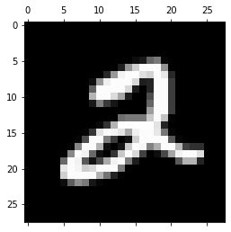
    


```python
transformer = MiniBatchSparsePCA(n_components=20, random_state=0, alpha=1000)
transformer.fit(train_imgs)

X_train = transformer.transform(train_imgs)
X_test = transformer.transform(test_imgs)

X_train.shape


```


    (60000, 10)


```python
for i in range(0,10):
    plt.matshow(np.reshape(transformer.components_[i,:], (28,28))) 
    plt.show()

```


    
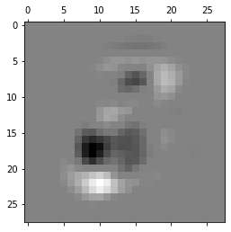
    


    
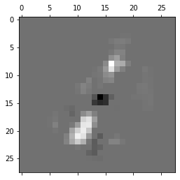
    


    
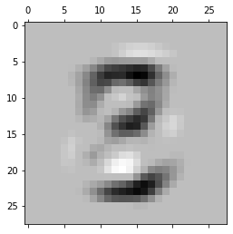
    


    
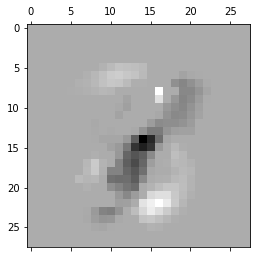
    


    
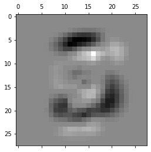
    


    
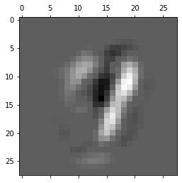
    


    
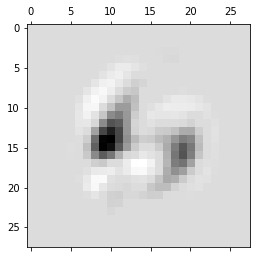
    


    
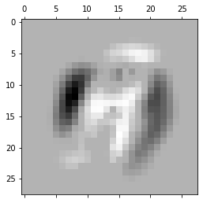
    


    
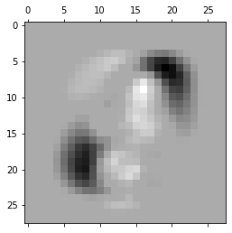
    


    
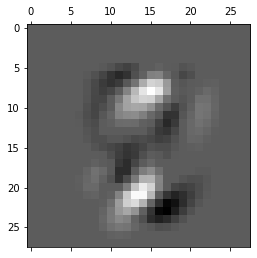
    


```python
mlp = MLPClassifier()
mlp.fit(X_train,y_train)
y_pred = mlp.predict(X_test)

print(classification_report(y_test,y_pred))

```

    /home/april/.local/lib/python3.6/site-packages/sklearn/neural_network/_multilayer_perceptron.py:934: DataConversionWarning: A column-vector y was passed when a 1d array was expected. Please change the shape of y to (n_samples, ), for example using ravel().
      y = column_or_1d(y, warn=True)


                  precision    recall  f1-score   support
    
             0.0       0.94      0.97      0.95       980
             1.0       0.98      0.98      0.98      1135
             2.0       0.93      0.89      0.91      1032
             3.0       0.78      0.93      0.85      1010
             4.0       0.85      0.88      0.87       982
             5.0       0.90      0.78      0.84       892
             6.0       0.95      0.95      0.95       958
             7.0       0.95      0.89      0.92      1028
             8.0       0.92      0.82      0.87       974
             9.0       0.81      0.85      0.83      1009
    
        accuracy                           0.90     10000
       macro avg       0.90      0.89      0.90     10000
    weighted avg       0.90      0.90      0.90     10000
    


```python

```
